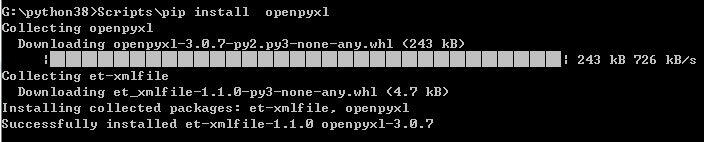

# python_env

用于开发python小工具的环境，以python插入式绿色版为基础，装了pip,但是如果要使用pip，请先调用python get-pip.py再重新安装一次，否则会出现各种报错、或者安装库的路径不对的情况 
Readme中有搭建环境的教程。

# 环境搭建教程
1、到python官网下载一个安装文件 
>https://www.python.org/downloads/windows/ 
>这里使用python3，为了方便，一般会把python跟工具源码放在一起，然后使用bat调用，因此，下载embeddable版本，同时embeddable版本也比installer安装的版本小很多。 
>要留意好版本说明，看看版本支持到的window版本，比如python3.9就不支持win7。 
>     

2、安装pip 
> 因为我们是用embeddable版本，里面基本除了python本身，什么功能都没有，因此装一个pip，方便获得第三方库。 
> 1>第一步新建一个文本文档，起名为get-pip，后缀名该为.py 
> 2>打开网址：https://bootstrap.pypa.io/get-pip.py，将网页上全部内容，拷贝到get-pip.py文件内。 
>     
> 3>修改python3x._pth内容(x为版本号，我下载的是python38，所以对应修改的是python38._pth) 
>     
> 4>运行get-pip.py文件，安装pip 
>> 因为这个环境是随项目走的，因此我们不修改系统路径，直接通过项目路径来走。 
>> I.Win+R，键入Cmd，回车，打开运行窗口 
>>>     
>> II.CD到python解压目录 
>> III.键入python get-pip.py开始安装 
>>>     
>> IV.验证pip，键入Scripts/pip --version，打印出当前pip版本号，如显示出版本号，则表示安装pip成功。 
>>>     

3、通过pip安装第三方库，调用的方法为pip install 库名，如我们要安装一个excel文件的读写库openpyxl，在当前环境下，我们可以键入 
> Scripts/pip install openpyxl 
>>>     

# 建议使用方式
1、将项目中的pythonXXXX文件夹拷贝到工作环境，xxxx为python的版本号。 
2、如果想使用pip来增加库，需要在cmd下再运行一下get_pip.py,运行过程请参考上面的说明。 
3、建立一个与上文件夹并列的目录，假设文件夹名字为Test，入口python文件为main.py.在这个文件夹下实现全部的python内容。 
4、在Test文件夹中新增一个bat文件，通过相对路径来调用python文件。如：..\python3810\python main.py 
